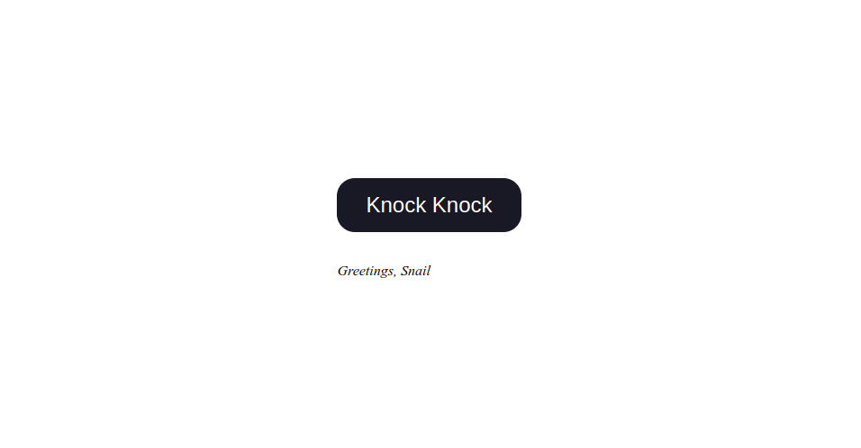

# WebPage-with-Bockchain

This is a simple blockchain project that demonstrates how to use Web3.js to interact with a smart contract on the Ethereum network. The smart contract, called HelloWorld, has a function called sayHello() which returns a greeting message.

## How to use

1. Clone the repository and open the index.html file in your web browser.
2. Click the "Knock Knock" button to display the greeting message from the smart contract.
